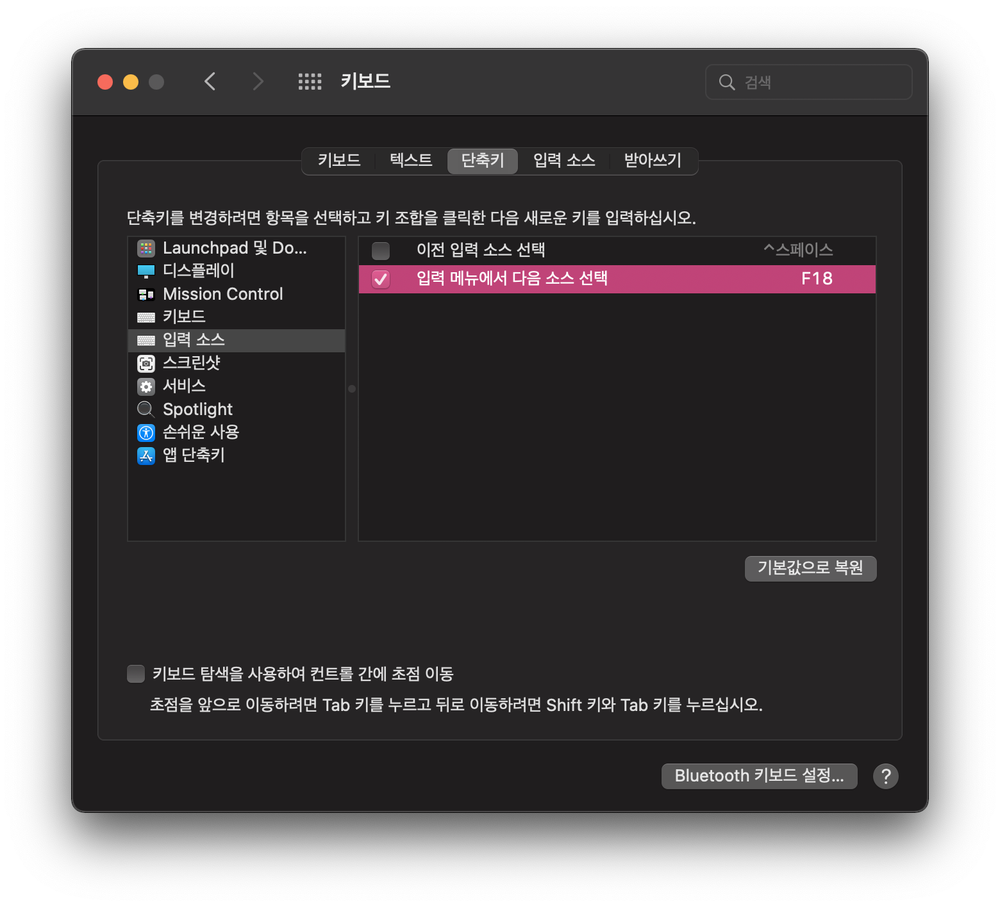

# macOS

## 한영 전환이 씹히는 현상 막기

<kbd>Caps Lock</kbd>을 눌렀을 때 다른 키가 눌린 것으로 인식하게한다. (<kbd>Caps Lock</kbd>의 영대문자 고정 기능은 쓰지 않는다)

<kbd>Caps Lock</kbd>을 눌렀을 때 인식되는 다른 키를 macOS의 한영 전환 단축키로 지정한다.

#### Karabiner-Elements 설치

https://karabiner-elements.pqrs.org/

#### Karabiner-Elements > Simple modifications > Add item

<kbd>Caps Lock</kbd>을 누르면 <kbd>F18</kbd>이 눌러지도록 설정

(왜인지는 모르나 정상적으로 동작하지 않는 키도 존재, <kbd>F18</kbd>은 항상 안정적이었음)

#### macOS > 시스템 환경설정 > 키보드 > 단축키 > 입력 소스

`입력 메뉴에서 다음 소스 선택`을 <kbd>Caps Lock</kbd>로 지정하면 <kbd>F18</kbd>로 설정됨

